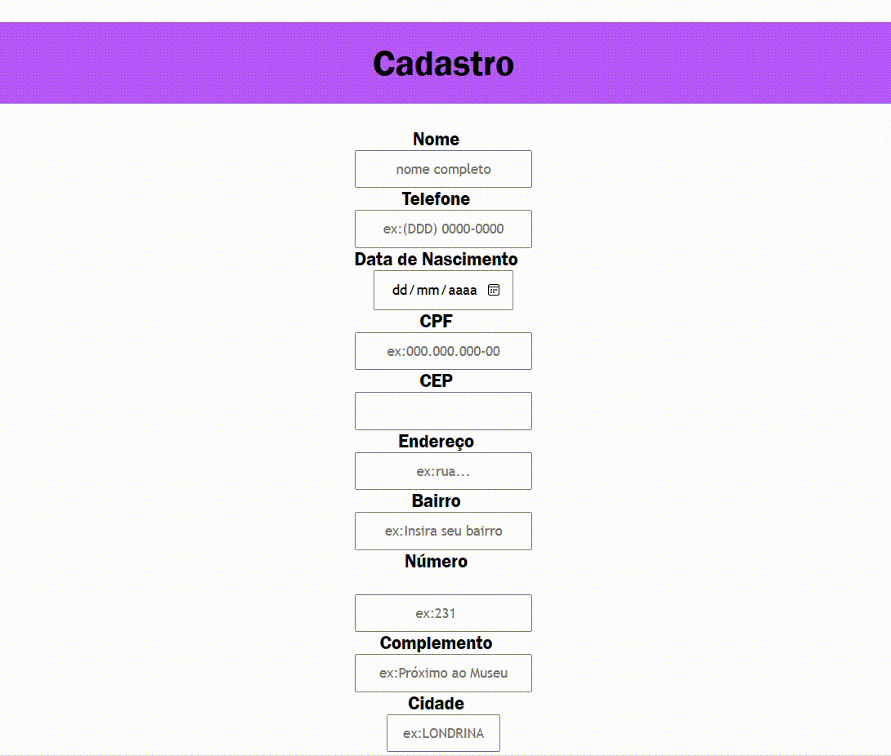

# 🔍 FormCadastro

## 📋 descrição
- `O site "Formulário de cadastro" é uma plataforma dedicada a cadastro para um site, feito em sala na aula de programação web I. Ele oferece um formulário de cadastro  que permite aos visitantes adicionar seus dados. O site é projetado de forma responsiva, garantindo uma experiência em diferentes dispositivos.`

## 🔧 Funcionalidades

- `1- O site apresenta um formulário de cadastro com os seguintes campos obrigatórios e opcionais:`
`Nome Completo:` Os visitantes são convidados a inserir seus nomes completos.
`CPF:` É necessário fornecer o número de CPF.
`Data de Nascimento:` Os usuários inserem suas datas de nascimento.
`E-mail:` Os endereços de e-mail são solicitados para comunicação e autenticação.
`Senha e Confirmar Senha:` Os visitantes criam senhas seguras e as confirmam.
`CEP, Endereço, Número, Complemento, Bairro, Cidade e Estado: `Informações de endereço são coletadas para fins de entrega ou localização.

## Benefícios
• `Registro Rápido e Conveniente:` O formulário de cadastro é intuitivo e eficiente, permitindo que os usuários concluam o processo de registro em questão de minutos.  
• `Facilidade de Uso em Dispositivos Móveis:`  O design responsivo do site permite que os usuários acessem e preencham o formulário em smartphones e tablets.  
• `O site de cadastro` é uma ferramenta essencial para receber novos membros e criar um ambiente seguro e confiável para interações futuras. Através desse processo, os usuários podem se beneficiar dos serviços e recursos oferecidos pelo site, ao mesmo tempo que têm a garantia de que suas informações estão protegidas.  
• `Ultilização de CSS:` O site tem o CSS com estilização bonita e a cor lilás que pode ser alterada    .

### 🛠️ Tecnologias Utilizadas
    
   - `github`     
   - `README`   
   - `HTML5`   
   - `CSS3`   
   - `js`   

## 🖇️ Fontes consultadas

[Bootstrap 5: Para fazer o html.](https://getbootstrap.com/docs/5.0/forms/layout/#gutters) 
[Via cep: Para consulta dos dados do cep](https://viacep.com.br/)

## 👀 Viaual do site

## ✒️ Autor

[ Emilly Caroline ](https://github.com/emillycaaroline)   

`Professor:`  
[ Leonardo Rocha ](https://github.com/LeonardoRochaMarista)  

